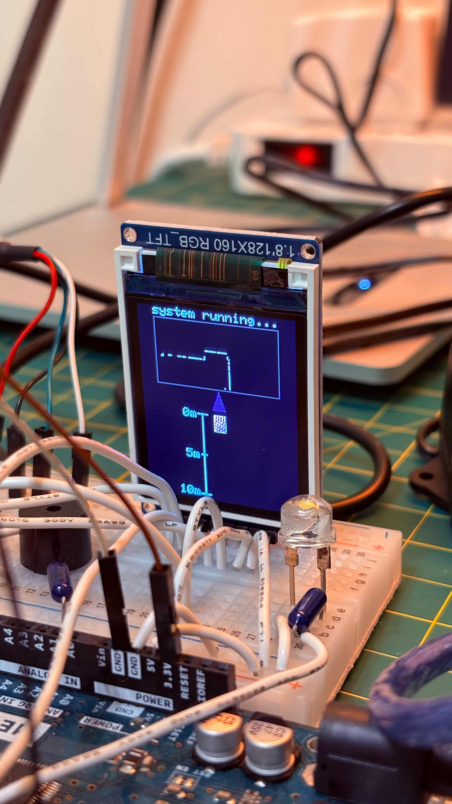
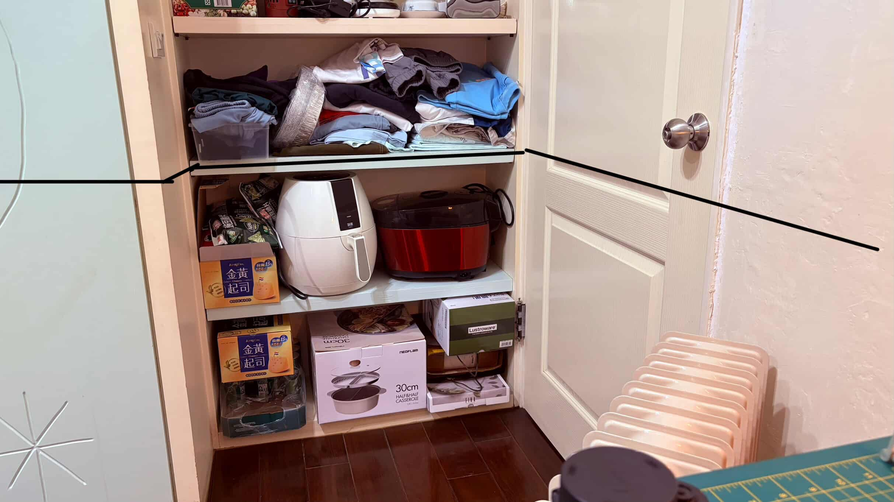
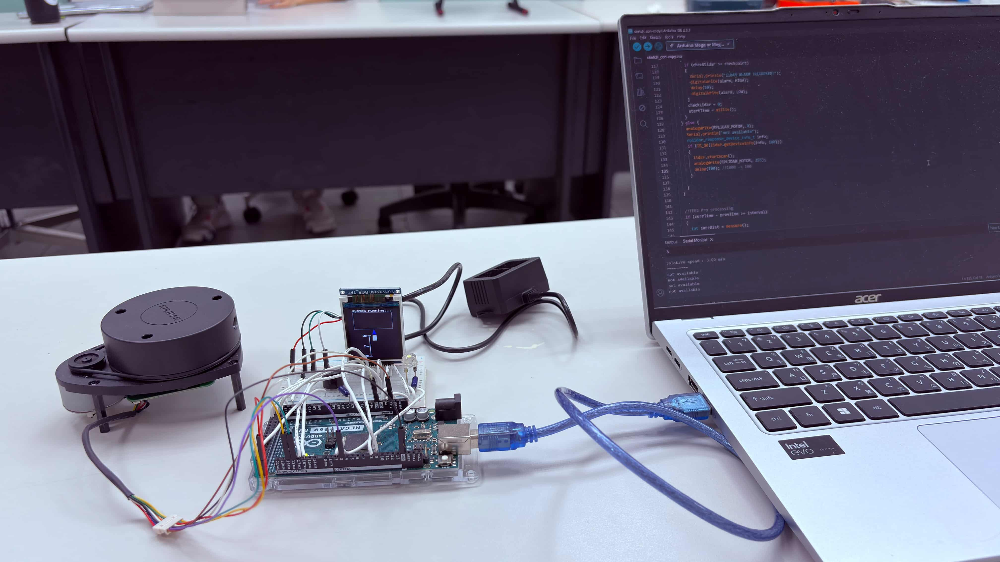

# Project Photos

## LCD Testing Photos
These photo show the testing environment and the corresponding ST7735 TFT display during system operation, including both front and rear detection.

### LCD Display

The triangle in the center represents the position of the bicycle (system reference point).  
The front square indicates detected obstacles, while the rear vertical bar visualizes the distance between the bicycle and approaching objects or vehicles.

# Testing Environment
This photo shows the real-world testing environment of the system.

The spatial arrangement of objects in this scene matches the contour displayed on the LCD, demonstrating the system’s capability to accurately capture and visualize surrounding structures.

## Development Documentation

The photo shows the hardware I use: RPLiDAR A1, TF-02 pro LiDAR, TFT screen and the micro controller Arduino mega 2560

